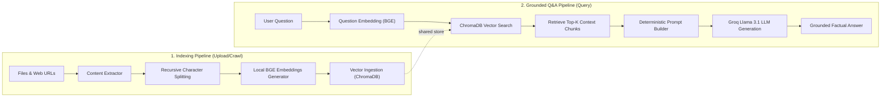

# 📚 Ask My Documents
### Cross-Document Grounded Intelligence via Local Vector Storage & Groq LLM

**Ask My Documents** is a Retrieval-Augmented Generation (RAG) system that allows you to index multiple files (PDF, DOCX, CSV, TXT, MD) or crawl website links, store their semantic embeddings in a local vector database, and ask natural language questions. Answers are compiled **strictly** from the context blocks in your loaded sources using state-of-the-art open models on Groq's high-speed inference engine.

---

## 🏗️ System Architecture

The project consists of two primary pipelines:



### Key Components:
1. **Content Extractor**: Parses incoming PDF text (`PyPDF2`), DOCX structures (`python-docx`), tabular CSV data, plain markdown/text, and processes web URLs using HTML scraping (`BeautifulSoup4`).
2. **Chunking Module**: Utilizes LangChain's `RecursiveCharacterTextSplitter` configured with `chunk_size=500` and `chunk_overlap=50` to split data into overlapping segments.
3. **Local Embedding Generator**: Converts raw text chunks into 384-dimensional vector embeddings using the open-source **BAAI/bge-small-en-v1.5** model running locally.
4. **Vector Database**: Utilizes ChromaDB to store text chunks, vector coordinates, and metadata configurations in memory.
5. **Retrieval Inspector**: Searches the vector database using similarity coordinates to return top candidate match chunks along with their source metadata and L2 similarity distance scores.
6. **Inference Generator (Groq)**: Builds a grounded system instruction prompt and sends it to the Groq API running `llama-3.1-8b-instant` to guarantee deterministic and factual answers.

---

## 🛠️ Technology Stack

| Layer | Component | Technologies |
|---|---|---|
| **Frontend** | User Interface | Next.js 13 (App Router), Vanilla CSS, React Hooks |
| **Backend** | API Gateway | FastAPI, Uvicorn, Pydantic |
| **Orchestration**| NLP & Splitters | LangChain, Beautiful Soup 4, docx, PyPDF2 |
| **Embeddings** | Vectors | HuggingFace Local Embeddings (`bge-small-en-v1.5`) |
| **Database** | Vector Store | ChromaDB (In-Memory) |
| **LLM** | LLM Engine | Groq Cloud API (`llama-3.1-8b-instant`) |

---

## 📂 Project Structure

```
01. RAG Project/
├── backend/            # FastAPI Backend API Server
│   └── main.py         # Main server router & indexing endpoints
├── frontend/           # Next.js Frontend Application
│   ├── src/app/        # App Router pages and CSS stylesheets
│   └── package.json    # Frontend dependency mappings
├── docs/               # System plans and architecture outlines
├── learning/           # Educational summaries of the RAG phases (Phase 1 to 10)
├── requirements.txt    # Python requirements listing
└── .env                # Server environmental keys
```

---

## 🚀 Setup & Execution Guide

### 1. Prerequisites
* Python 3.9+
* Node.js 18+ and `npm`

### 2. Configuration
Create a `.env` file in the root directory:
```env
GROQ_API_KEY=your_groq_api_key_here
```
> Get your free Groq API key from the [Groq Console](https://console.groq.com/).

---

### 3. Running the Backend Server
Initialize the Python virtual environment, install the dependencies, and launch FastAPI:

```bash
# 1. Create a virtual environment
python3 -m venv venv

# 2. Activate the environment
source venv/bin/activate

# 3. Install requirements
pip install -r requirements.txt

# 4. Start the FastAPI API server
uvicorn backend.main:app --reload --port 8000
```
The API documentation will be available at [http://localhost:8000/docs](http://localhost:8000/docs).

---

### 4. Running the Frontend Server
Navigate to the frontend folder, install dependencies, and launch the development server:

```bash
# 1. Navigate to the frontend directory
cd frontend

# 2. Install dependencies
npm install

# 3. Launch Next.js dev server
npm run dev
```
Open [http://localhost:3000](http://localhost:3000) in your browser to interact with the application.

---

## 🎓 Phase Learning Deliverables
For details about the concepts behind each stage of the implementation (from initial project setup up to vector database integration and Groq answer generation), look at the markdown files in the [learning/](file:///Users/shubhamthakur/Downloads/nextleap%20antigravity%20projects/01.%20RAG%20Project/learning) directory.
