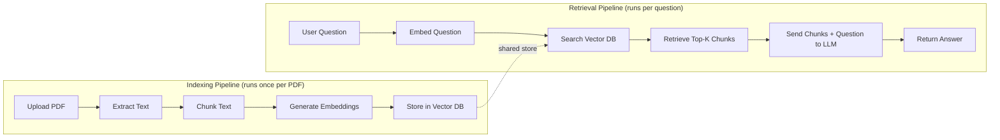
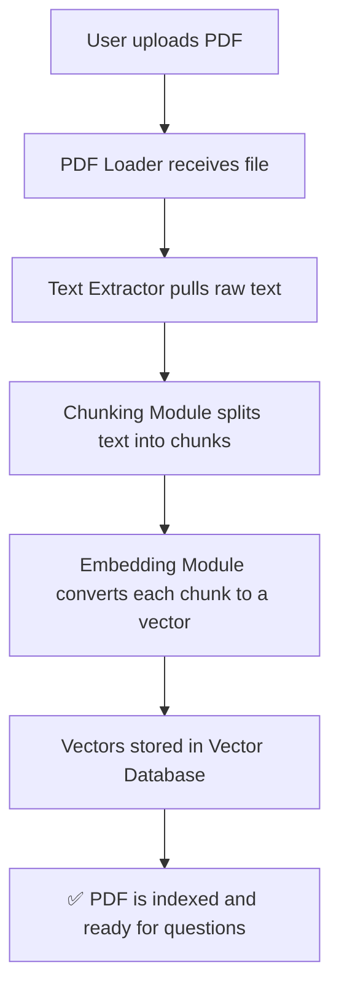
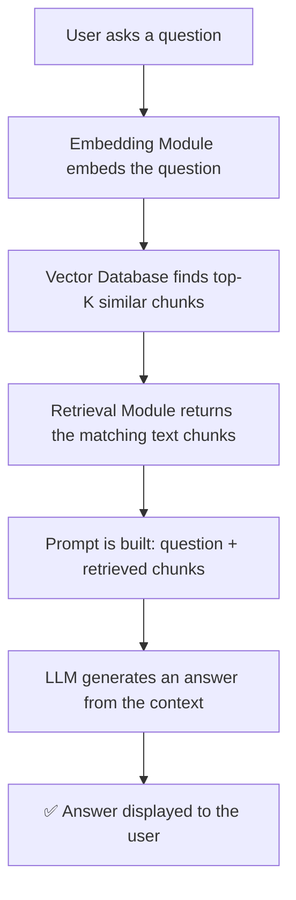
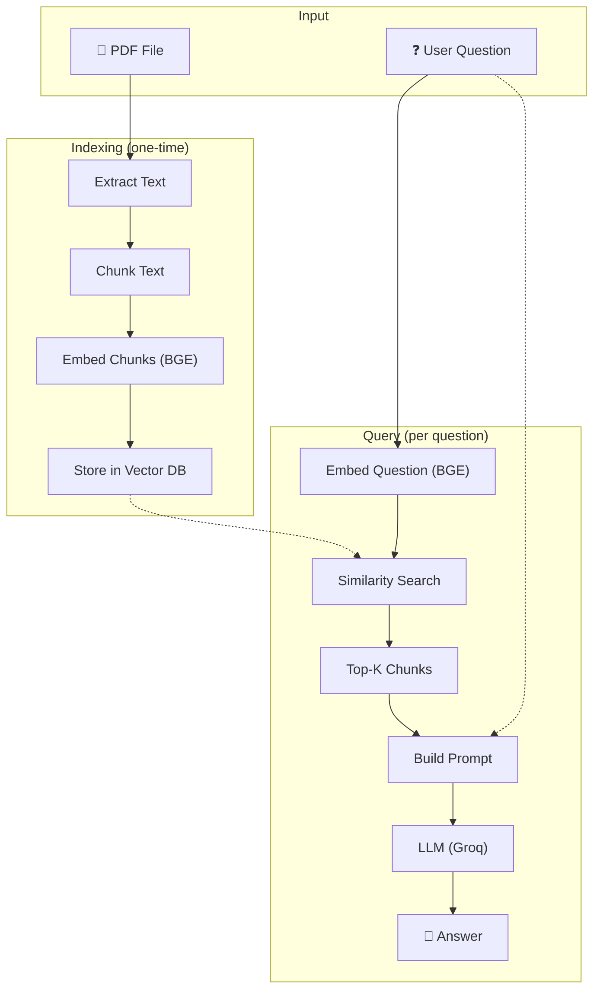

# Ask My PDF — Architecture

## 1. Project Overview

**Ask My PDF** is a beginner-friendly RAG (Retrieval-Augmented Generation) application. A user uploads a single PDF, and the system lets them ask natural language questions about it. Answers are generated **only** from the PDF content — not from the LLM's general knowledge.

The architecture is intentionally simple. There are no microservices, no cloud infrastructure, and no production optimizations. Every component exists to teach one clear concept in the RAG pipeline.

---

## 2. High-Level Architecture

The system is split into two pipelines that share a common vector store:



- **Indexing Pipeline** — Processes the PDF once and stores its content as vector embeddings.
- **Retrieval Pipeline** — Takes a user question, finds the most relevant chunks, and generates an answer using the LLM.

---

## 3. Core Components

Each component handles exactly one responsibility in the pipeline.

### 3.1 PDF Loader

| | |
|---|---|
| **What it does** | Accepts a single PDF file uploaded by the user. |
| **Input** | PDF file (from the UI file picker). |
| **Output** | Raw PDF file object passed to the text extractor. |
| **Key detail** | Only one PDF at a time. Uploading a new PDF replaces the previous one. |

---

### 3.2 Text Extractor

| | |
|---|---|
| **What it does** | Reads the PDF and extracts raw text from each page. |
| **Input** | PDF file object from the PDF Loader. |
| **Output** | Plain text string (full document text). |
| **Key detail** | Works only on text-based PDFs. Scanned documents or images within PDFs are not supported. |

---

### 3.3 Chunking Module

| | |
|---|---|
| **What it does** | Splits the extracted text into smaller, overlapping pieces (chunks). |
| **Input** | Full document text from the Text Extractor. |
| **Output** | A list of text chunks. |
| **Why chunking?** | LLMs have limited context windows. Smaller chunks also improve retrieval precision — the system can find the *specific* paragraph that answers a question rather than returning an entire page. |
| **Strategy** | Fixed-size chunks with overlap (e.g., 500 characters with 50-character overlap) to avoid cutting sentences at boundaries. |

---

### 3.4 Embedding Module (BGE)

| | |
|---|---|
| **What it does** | Converts each text chunk (and later, the user's question) into a numerical vector (embedding). |
| **Input** | A text chunk or a user question. |
| **Output** | A dense vector (list of numbers) representing the semantic meaning of the input. |
| **Model** | BGE (BAAI General Embedding) — an open-source embedding model that runs locally. |
| **Why BGE?** | Free, no API key needed, runs locally, and produces high-quality embeddings suitable for semantic search. |

---

### 3.5 Vector Database

| | |
|---|---|
| **What it does** | Stores chunk embeddings and performs similarity search. |
| **Input** | Embeddings from the Embedding Module. |
| **Output** | Top-K most similar chunks for a given query embedding. |
| **Implementation** | In-memory vector store (e.g., FAISS or ChromaDB). No external database server needed. |
| **Key detail** | Data is not persisted across sessions. When the app restarts, the PDF must be re-uploaded and re-indexed. |

---

### 3.6 Retrieval Module

| | |
|---|---|
| **What it does** | Takes the user's question, converts it to an embedding, and queries the vector database to find the most relevant chunks. |
| **Input** | User's question (text). |
| **Output** | Top-K relevant text chunks from the PDF. |
| **How it works** | The question is embedded using the same BGE model. The vector database returns the chunks whose embeddings are closest (most semantically similar) to the question embedding. |

---

### 3.7 LLM (Groq)

| | |
|---|---|
| **What it does** | Generates a natural language answer using the retrieved chunks as context. |
| **Input** | User's question + retrieved text chunks (combined into a prompt). |
| **Output** | A text answer grounded in the PDF content. |
| **Provider** | Groq — a fast LLM inference API. |
| **Why Groq?** | Free tier available, fast response times, simple API, and supports popular open-source models. |
| **Key detail** | The LLM is instructed (via the prompt) to answer **only** from the provided context. If the context doesn't contain the answer, it should say so. |

---

## 4. Indexing Pipeline

The indexing pipeline runs **once** when a user uploads a PDF. It transforms the document into searchable vector embeddings.



**Step-by-step:**

| Step | Component | Action |
|------|-----------|--------|
| 1 | PDF Loader | Receives the uploaded PDF file. |
| 2 | Text Extractor | Extracts all text from the PDF pages. |
| 3 | Chunking Module | Splits the text into overlapping chunks (e.g., 500 chars, 50 overlap). |
| 4 | Embedding Module | Converts each chunk into a vector embedding using BGE. |
| 5 | Vector Database | Stores all chunk embeddings along with their original text. |

After indexing, the system is ready to answer questions.

---

## 5. Retrieval Pipeline

The retrieval pipeline runs **every time** a user asks a question. It finds relevant content and generates an answer.



**Step-by-step:**

| Step | Component | Action |
|------|-----------|--------|
| 1 | Embedding Module | Converts the user's question into a vector embedding using the same BGE model. |
| 2 | Vector Database | Performs a similarity search and returns the top-K closest chunks. |
| 3 | Retrieval Module | Passes the matching text chunks to the prompt builder. |
| 4 | Prompt Builder | Constructs a prompt containing the question and the retrieved chunks as context. |
| 5 | LLM (Groq) | Generates an answer grounded only in the provided context. |

> **Important:** The same embedding model (BGE) must be used for both indexing and querying. If different models are used, the vectors won't be comparable and retrieval will fail.

---

## 6. Technology Stack

| Layer | Technology | Purpose |
|-------|------------|---------|
| **Language** | Python | Primary programming language. |
| **UI Framework** | Streamlit | Simple web UI for file upload and chat. |
| **PDF Parsing** | PyPDF2 / pdfplumber | Extract text from PDF files. |
| **Chunking** | LangChain Text Splitters | Split text into overlapping chunks. |
| **Embeddings** | BGE (via HuggingFace) | Convert text to vector embeddings locally. |
| **Vector Store** | FAISS / ChromaDB | In-memory similarity search. |
| **LLM** | Groq API | Fast LLM inference for answer generation. |
| **Orchestration** | LangChain | Chain together the retrieval and generation steps. |

---

## 7. Data Flow

End-to-end data flow showing how a PDF becomes answers:



**Data transformations at each stage:**

```
PDF File  →  Raw Text  →  Text Chunks  →  Vector Embeddings  →  Stored Vectors
                                                                       ↓
User Question  →  Question Embedding  →  Similarity Search  →  Top-K Chunks
                                                                       ↓
                                              Question + Chunks  →  LLM  →  Answer
```

---

> **This architecture is designed for learning. Every component maps directly to a stage in the RAG pipeline, making it easy to understand, debug, and experiment with.**
