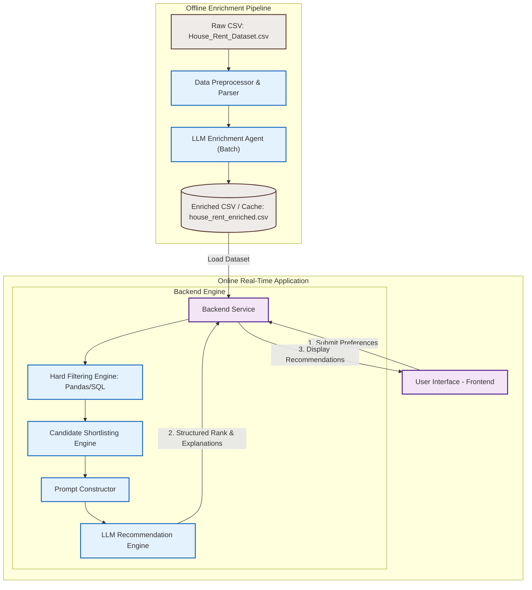
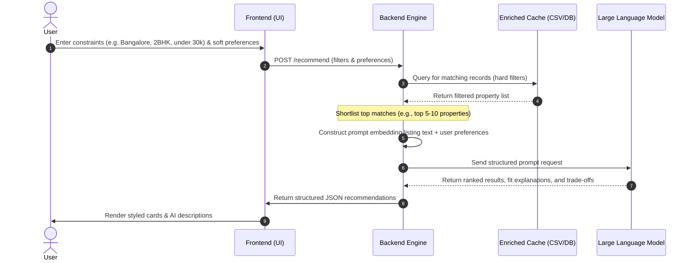

# System Architecture: AI-Powered Rental Property Recommendation System

This document outlines the detailed system architecture, data models, processing pipelines, and flow diagrams for the AI-Powered Rental Property Recommendation System.

---

## 1. High-Level System Architecture

The application is split into two primary phases:
1. **Offline Processing Pipeline (Batch / One-Time):** Ingests the raw dataset, cleans fields, enriches the dataset with synthetic text layers using an LLM, and caches the result.
2. **Online Query Service (Real-Time):** Processes user queries, runs programmatic hard filters, constructs context-rich prompts, and coordinates with the LLM to deliver ranked recommendations with explainability.



---

## 2. Component Breakdown

### A. Offline Enrichment Pipeline
* **Data Preprocessor:** 
  * Loads `House_Rent_Dataset.csv`.
  * Standardizes text inputs and handles nulls or duplicates.
  * Parses complex/dirty fields. Specifically, converts the `Floor` column (e.g., `"2 out of 5"`, `"Ground out of 2"`, `"3"`) into two clean numeric features: `floor_number` (integer) and `total_floors` (integer).
* **LLM Enrichment Generator:** 
  * Iterates over properties in batches.
  * Sends structured listings to the LLM to generate:
    * A simulated **property description** highlighting potential lifestyle appeal.
    * A simulated **tenant review** representing past experiences.
    * A list of **inferred amenities** based on locality, BHK, size, and rent.
  * To minimize cost and latency, this process runs **only once** (offline) and saves the output to a cached file (`house_rent_enriched.csv`).

### B. Online Backend Service
* **Hard Filtering Engine:**
  * Uses Pandas or SQL query builder to apply hard criteria entered by the user:
    * `City` == User Selected City
    * `Rent` between User Min & Max Budget
    * `BHK` matches User Selected BHK Config
    * `Furnishing Status` == User Selected Furnishing
    * `Tenant Preferred` matches User Profile
  * Programmatic execution guarantees 100% precision and sub-millisecond query performance.
* **Shortlisting / Candidate Selection:**
  * If the filtered set is too large (e.g., > 10 listings), down-selects the top candidates. Down-selection can be based on proximity to the budget midpoint, size-to-rent ratio, or random sampling to maintain prompt token limit efficiency.
* **Prompt Constructor:**
  * Combines the shortlisted candidate properties (including their offline-generated synthetic description, reviews, and amenities) with the user's **soft preferences** (e.g., *"needs to be peaceful and suitable for remote work"*).
  * Wraps everything in a highly structured LLM prompt instruction set.
* **LLM Recommendation Engine:**
  * Runs the inference to obtain ranked matches.
  * Forces structured output (like JSON or specific Markdown blocks) containing rankings, explanations, and trade-off comparisons.

### C. Frontend Interface
* **Control / Input Panel:** Form elements for selecting hard filters and a search/text field for entering natural language soft preferences.
* **Results Panel:** A clean, grid/card-based layout displaying:
  * Property cards (monthly rent, BHK configuration, locality, furnishing status).
  * Interactive accordion or tab displaying the "AI Fit Analysis" (explanation + trade-offs).

---

## 3. Data Flow Diagram (Query to Output)

The flow sequence for a single user query is detailed below:



---

## 4. Prompt Engineering Strategy

To ensure high-quality recommendations, the prompt constructed for the LLM needs to follow a rigorous structure.

### Prompt Components
1. **System Prompt (Role Definition):** Defines the LLM as an expert real estate consultant for the Indian housing market.
2. **Context Injection:** Injecting the top shortlisted properties in a clean format:
   ```yaml
   Property ID: [ID]
   Locality: [Locality, City]
   BHK: [BHK] | Size: [Size SqFt] | Rent: [Rent INR]
   Amenities: [Amenities List from Synthetic Layer]
   Synthetic Review: [Review from Synthetic Layer]
   Description: [Description from Synthetic Layer]
   ```
3. **User Preferences Input:** Merging the user's hard limits and soft text prompts.
4. **Output Guidelines:** Instructions specifying:
   - Rank the properties from best fit to lowest fit.
   - For each property, write a 2-3 sentence explanation targeting the user's soft preferences.
   - Detail any trade-offs (e.g., budget vs. distance or size).

---

## 5. Technology Stack Recommendations

* **Frontend:** **Streamlit** (for rapid Python-based UI prototyping) or **Next.js + TailwindCSS** (for a production-grade, highly customized web app).
* **Backend:** **FastAPI** or **Flask** (Python) to leverage native Pandas integration for database operations and dataframes processing.
* **Data Manipulation & Querying:** **Pandas** for ingestion, cleaning, and fast execution of hard filters.
* **LLM Integration:** **Groq SDK** (official `groq` Python library) or **LiteLLM / LangChain** configured with Groq API keys to access fast open models (e.g., Llama 3, Mixtral).
* **Storage:** Local **SQLite** database or optimized **Parquet/CSV** file containing the enriched dataset.
